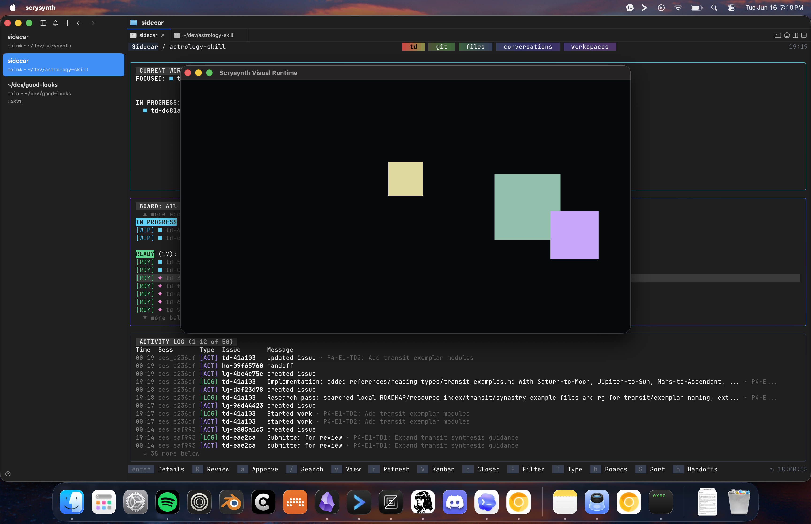

# Phase 8 Visual Runtime UAT

## Scope

This pass verified the real v1 visual runtime path that exists today:

- The app-owned Rust visual manager starts a separate `scrysynth-visual` process.
- The sidecar speaks the Phase 8 JSON-lines protocol over stdio.
- Handshake, scene load, live parameter update, graceful stop, panic stop, and restart after panic are real process behavior.
- The default renderer now opens a visible Bevy sidecar window (`scrysynth-bevy-visual`) and reports active rendering after scene load.

## Visible Bevy Output UAT

Command: a Python UAT script spawned `src-tauri/target/debug/scrysynth-visual`, sent newline-delimited JSON protocol messages, captured the Bevy window with `screencapture`, panic-shutdown the sidecar, and repeated the launch/load/update path after panic.

Observed protocol result:

```text
ready renderer=scrysynth-bevy-visual capabilities=scene_load,parameter_batch,rendering_status,shutdown
sceneLoaded scene=visible-uat-scene rendering=true
parameterBatchApplied count=2
shutdownComplete mode=panic
restart ready renderer=scrysynth-bevy-visual
restart sceneLoaded scene=visible-uat-scene rendering=true
restart parameterBatchApplied count=2
restart shutdownComplete mode=panic
```

Visual evidence:



Verified behavior:

- Starting the visual runtime opens the clearly labeled `Scrysynth Visual Runtime` Bevy window.
- Scene pixels are produced from the app-sent scene snapshot, not frontend-owned drawing state.
- Live parameter updates alter the rendered sprite colors/scales and acknowledge the applied patch count.
- Scene load reports `rendering: true`, which the app maps to visual lifecycle `rendering`; the minimal protocol mode reports `rendering: false` and remains `ready`.
- Panic shutdown closes/clears the sidecar process predictably and a fresh launch after panic renders the same scene again.

Result: passed.

## Local Setup

Repository: `/Users/eggfam/dev/scrysynth`

Built sidecar:

```sh
cargo build --manifest-path src-tauri/Cargo.toml --bin scrysynth-visual
```

Observed result:

```text
Finished `dev` profile [unoptimized + debuginfo] target(s)
```

Runtime path used by the manager integration test:

```sh
SCRYSYNTH_BEVY_PATH="$PWD/src-tauri/target/debug/scrysynth-visual"
```

## Missing Sidecar Diagnostics

Command:

```sh
cargo test --manifest-path src-tauri/Cargo.toml visual::bevy_sidecar::tests::adapter_reports_missing_configured_sidecar_with_setup_guidance
```

Observed result:

```text
test visual::bevy_sidecar::tests::adapter_reports_missing_configured_sidecar_with_setup_guidance ... ok
```

Verified diagnostic content:

```text
visual runtime binary not found
SCRYSYNTH_BEVY_PATH
scrysynth-visual
```

Result: passed. A missing or invalid configured sidecar path produces actionable setup guidance instead of a generic spawn failure.

## Real Manager And Adapter Path

Command:

```sh
cargo test --manifest-path src-tauri/Cargo.toml --test visual_sidecar_uat
```

Observed result:

```text
running 1 test
test visual_manager_drives_real_minimal_sidecar_lifecycle ... ok
```

Verified behavior:

- Start launches the real `scrysynth-visual` binary through `BevySidecarAdapter`.
- Handshake returns renderer `scrysynth-minimal-visual`.
- Scene load acknowledges the active scene ID.
- Live graph parameter edit sends a visual parameter batch and remains healthy.
- Stop transitions visual lifecycle to `idle` and runtime connection to `disconnected`.
- Restart after stop returns to `ready` and reloads the preserved active scene.
- Panic transitions visual lifecycle to `panicked`, health to `degraded`, and connection to `disconnected`.
- Restart after panic returns to `ready` with the same active scene and renderer.

Result: passed.

## Direct Sidecar Protocol UAT

Command: a Node one-shot script spawned `src-tauri/target/debug/scrysynth-visual` three times and sent newline-delimited JSON protocol messages:

1. Graceful path: `handshake`, `loadScene`, `updateParameters`, `shutdown { mode: "graceful" }`.
2. Panic path: `handshake`, `loadScene`, `updateParameters`, `shutdown { mode: "panic" }`.
3. Restart path: new process after panic with `handshake`, `loadScene`, `shutdown { mode: "graceful" }`.

Observed output:

```text
## graceful stop
ready renderer=scrysynth-minimal-visual version=0.1.0
event info: minimal visual runtime ready
sceneLoaded scene=intro
parameterBatchApplied count=1
shutdownComplete mode=graceful
## panic stop
ready renderer=scrysynth-minimal-visual version=0.1.0
event info: minimal visual runtime ready
sceneLoaded scene=intro
parameterBatchApplied count=1
shutdownComplete mode=panic
## restart after panic
ready renderer=scrysynth-minimal-visual version=0.1.0
event info: minimal visual runtime ready
sceneLoaded scene=intro
shutdownComplete mode=graceful
```

Result: passed.

## Runtime Health Panel Evidence

Verified by frontend projection tests and TypeScript build:

- Missing sidecar projects as `missing sidecar / restartable` with `SCRYSYNTH_BEVY_PATH` guidance.
- Booting projects from lifecycle `starting` or connection `connecting`.
- Ready projects active scene name/ID, renderer, connection state, and FPS telemetry label.
- Stopped projects as `stopped / disconnected`.
- Panic projects as `panicked / restartable`.
- Visual start/stop/panic controls are exposed from the Runtime Health panel according to lifecycle state.

Relevant tests:

```sh
npm test
npm run build
```

Observed result:

```text
Test Files  3 passed (3)
Tests  26 passed (26)
npm run build passed
```

## Full Verification Commands

Commands run for this task:

```sh
npm test
npm run build
cargo build --manifest-path src-tauri/Cargo.toml --bin scrysynth-visual
cargo test --manifest-path src-tauri/Cargo.toml visual::bevy_sidecar::tests::adapter_reports_missing_configured_sidecar_with_setup_guidance
cargo test --manifest-path src-tauri/Cargo.toml --test visual_sidecar_uat
cargo test --manifest-path src-tauri/Cargo.toml
```

Final full-suite result: passed.

## Remaining Limits

- The Bevy renderer is intentionally simple: it renders visible scene-driven sprites, but does not yet provide a sophisticated audiovisual composition language.
- No packaged Tauri sidecar bundle path is wired yet; local development uses `SCRYSYNTH_BEVY_PATH` or `scrysynth-visual` on `PATH`.
- Runtime telemetry events are protocol-defined, but the minimal sidecar does not yet emit live FPS telemetry.
